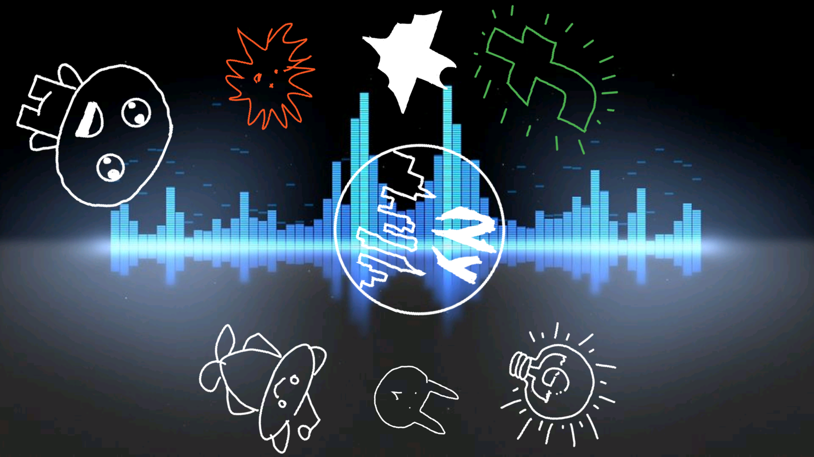
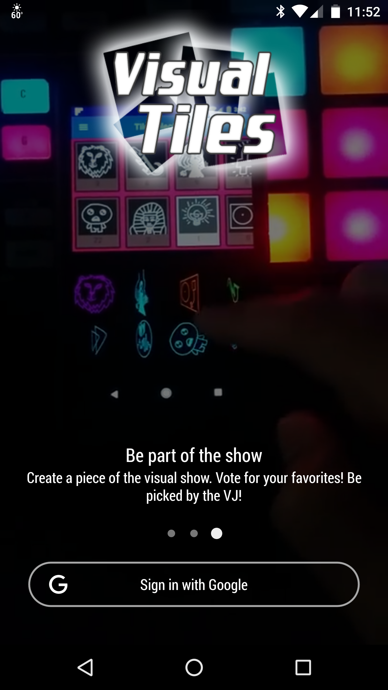
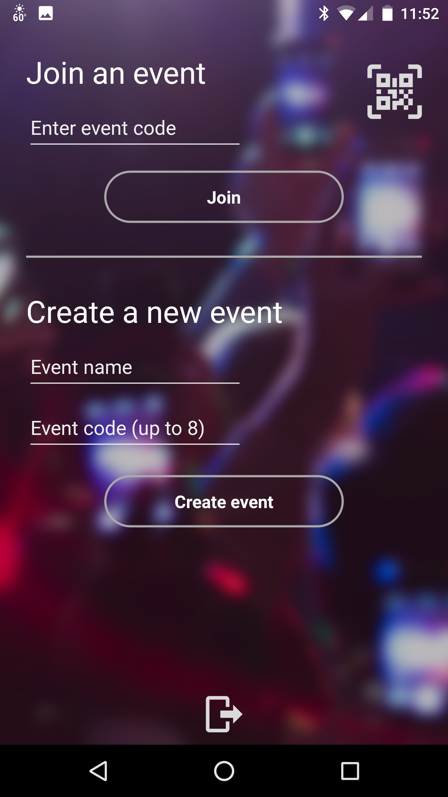
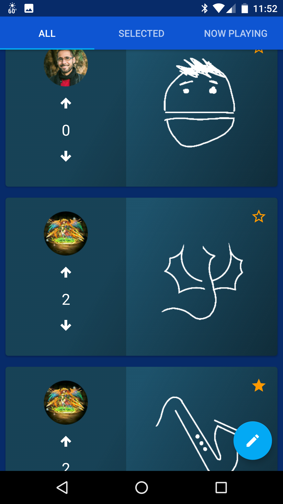
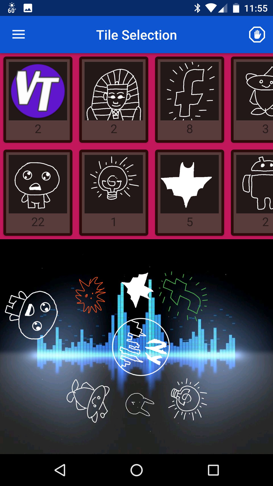
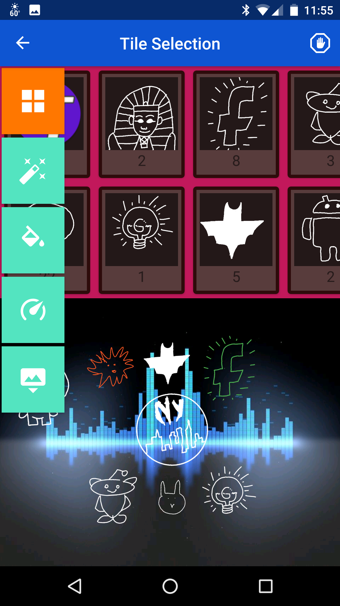
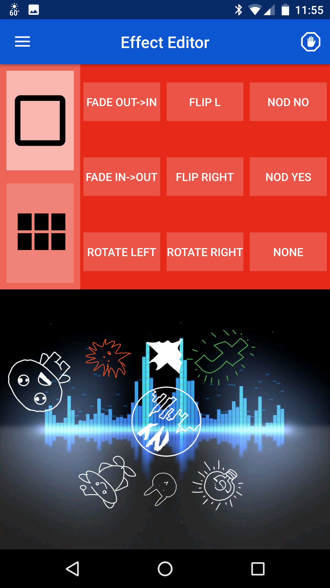
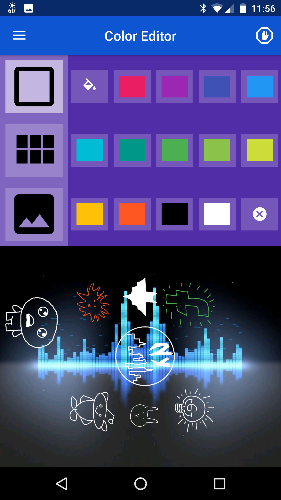
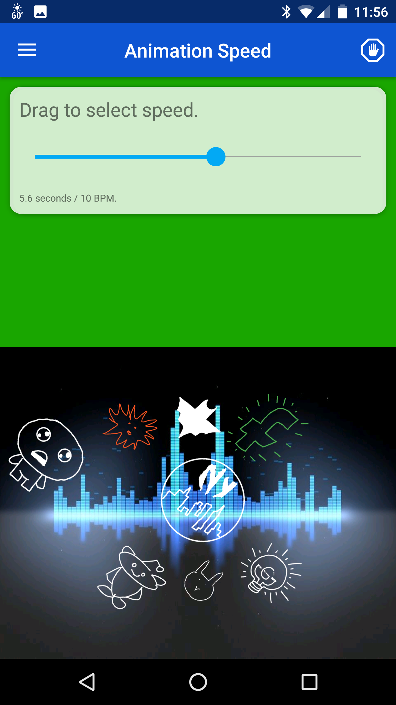
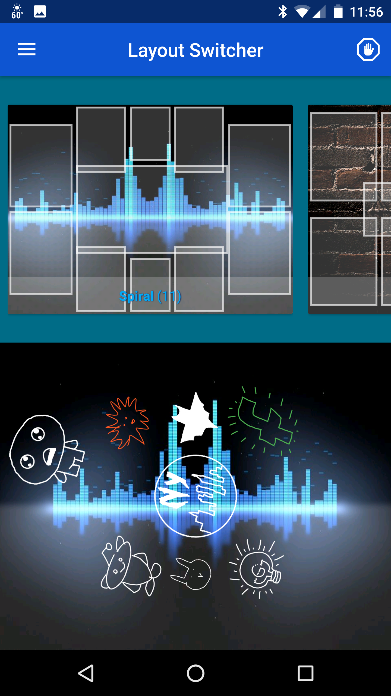

# Visual Tiles Together

**Visual Tiles Together** turns your mobile phone or tablet into a VJ platform to allow realtime visual performance.

A **User** can add "Visual Tiles" to the main tile canvas. Each visual tile can have a drawn graphic and can have effects assigned to them by the **Moderator** (VJ). The app can then be put into **Presenter Mode** and display the main canvas and its tiles and tile effects. The **presenter** listens for updates to tiles (swapping tile images with new ones) and changes to the tiles' colors and effects.

**Users** can use the app to join the event and create visual tiles, drawing and sharing creations of their own for everyone at the event to see. The tiles they create are added to a queue from which the **Moderator** user can select and add to the main visual canvas.

This app was built as a final project for [Android Mobile Bootcamp](https://codepath.com/androidbootcamp) at Facebook in late 2016. It is available on the [Google Play Store](https://play.google.com/store/apps/details?id=com.javierarboleda.visualtilestogether)

## Installing

Install the app from the Play Store. Alternatively, clone the repository, build and install using [this guideline](http://developer.android.com/tools/building/building-cmdline.html).

## License

Copyright 2016 Chris Spack, George Cohn III, Javier Arboleda

Licensed under the Apache License, Version 2.0 (the "License");
you may not use this file except in compliance with the License.
You may obtain a copy of the License at

    http://www.apache.org/licenses/LICENSE-2.0

Unless required by applicable law or agreed to in writing, software
distributed under the License is distributed on an "AS IS" BASIS,
WITHOUT WARRANTIES OR CONDITIONS OF ANY KIND, either express or implied.
See the License for the specific language governing permissions and
limitations under the License.

## Acknowledgements

The code uses the following open source libraries
* [Calligraphy](https://github.com/chrisjenx/Calligraphy)
* [CircularReveal](https://github.com/ozodrukh/CircularReveal)
* [circular-progress-button](https://github.com/dmytrodanylyk/circular-progress-button)
* [colorpicker](https://github.com/QuadFlask/colorpicker:0.0.12)
* [discreteSeekBar](https://github.com/AnderWeb/discreteSeekBar)
* [glide](https://github.com/bumptech/glide)
* [glide-transformations](https://github.com/wasabeef/glide-transformations)
* [ParallaxPagerTransformer](https://github.com/xgc1986/ParallaxPagerTransformer)
* [retrofit2](https://github.com/square/retrofit)
* [RxAndroid/RxJava](https://github.com/ReactiveX/RxAndroid)
* [zxing](https://github.com/zxing/zxing)

## Screenshots

